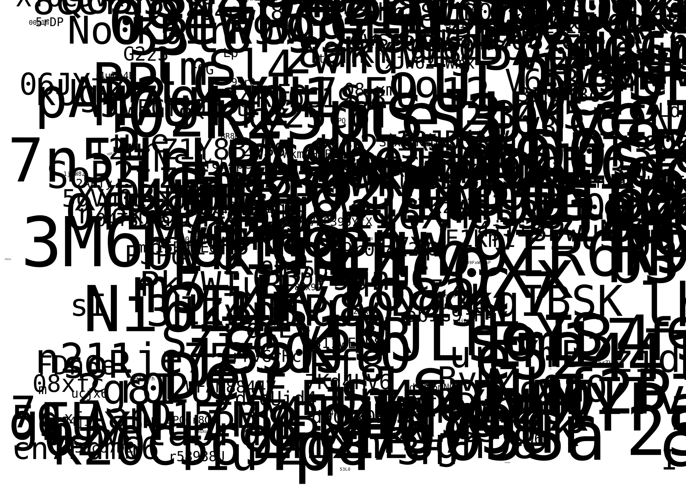

# genuary

my attempts at the genuary.art prompts

# Day 1: "Particles, lots of them."

[code](2024/genuary_2024_1.blend)

## Day 2: No palettes.

[code](2024/genuary_2024_2.py)

## Day 3: "Droste effect.

 [code](2024/genuary_2024_3.py)

## Day 4: "Pixels."

 [code](2024/genuary_2024_4.py)

## Day5: In the style of Vera Molnár (1924-2023).

 [code](2024/genuary_2024_5.py)

## Day6: Screensaver.

 [code](2024/genuary_2024_6.py)

## Day7: Progress bar / indicator / loading animation.

 [code](2024/genuary_2024_7.py)

## Day8: Chaotic system.

 [code](2024/genuary_2024_8.py)

## Day9: ASCII.

 
[code](2024/genuary_2024_9.py)

## Day10: Hexagonal.

 
[code](2024/genuary_2024_10.py)
<!-- 
## Day 11: In the style of Anni Albers (1899-1994).

[code](2024/genuary_2024_11.py)

## Day 12: Lava lamp.

[code](2024/genuary_2024_12.py)

## Day 13: Wobbly function day.

[code](2024/genuary_2024_13.py)

## Day 14: Less than 1KB artwork.

[code](2024/genuary_2024_14.py)

## Day 15: Use a physics library.

[code](2024/genuary_2024_15.py)

## Day 16: Draw 10 000 of something.

[code](2024/genuary_2024_16.py)

## Day 17: Inspired by Islamic art.

[code](2024/genuary_2024_17.py)

## Day 18: Bauhaus.

[code](2024/genuary_2024_18.py)

## Day19: Flocking.

[code](2024/genuary_2024_19.py)

## Day20: Generative typography.

[code](2024/genuary_2024_20.py)

## Day21: Use a library that you haven’t used before.

[code](2024/genuary_2024_21.py)

## Day22: Point - line - plane.

[code](2024/genuary_2024_22.py)

## Day23: 64×64.

[code](2024/genuary_2024_23.py)

## Day24: Impossible objects (undecided geometry).

[code](2024/genuary_2024_24.py)

## Day25: “I should try to recreate this with code”.

[code](2024/genuary_2024_25.py)

## Day26: Grow a seed.

[code](2024/genuary_2024_26.py)

## Day27: Code for one hour.

[code](2024/genuary_2024_27.py)

## Day28: Skeuomorphism.

[code](2024/genuary_2024_28.py)

## Day29: Signed Distance Functions 

*(if we keep trying once per year, eventually we will be good at it!).*

[code](2024/genuary_2024_29.py)

## Day30: Shaders.

[code](2024/genuary_2024_30.py)

## Day31: Generative music / Generative audio / Generative sound.

[code](2024/genuary_2024_31.py) -->
