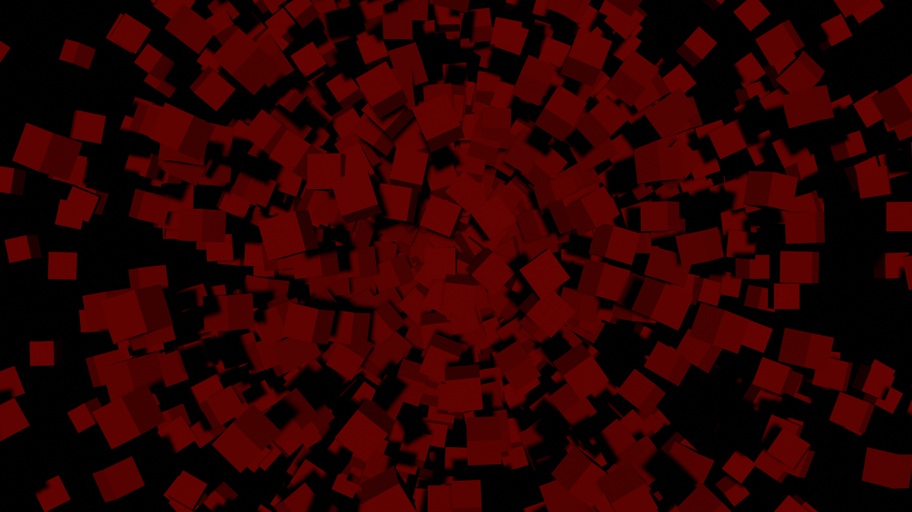
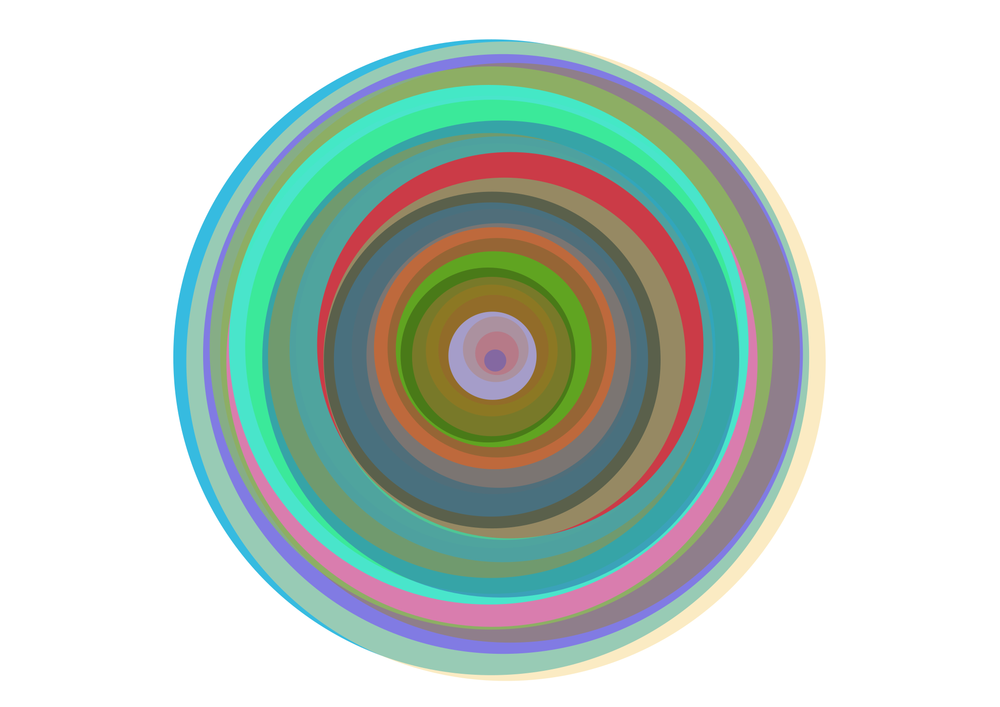
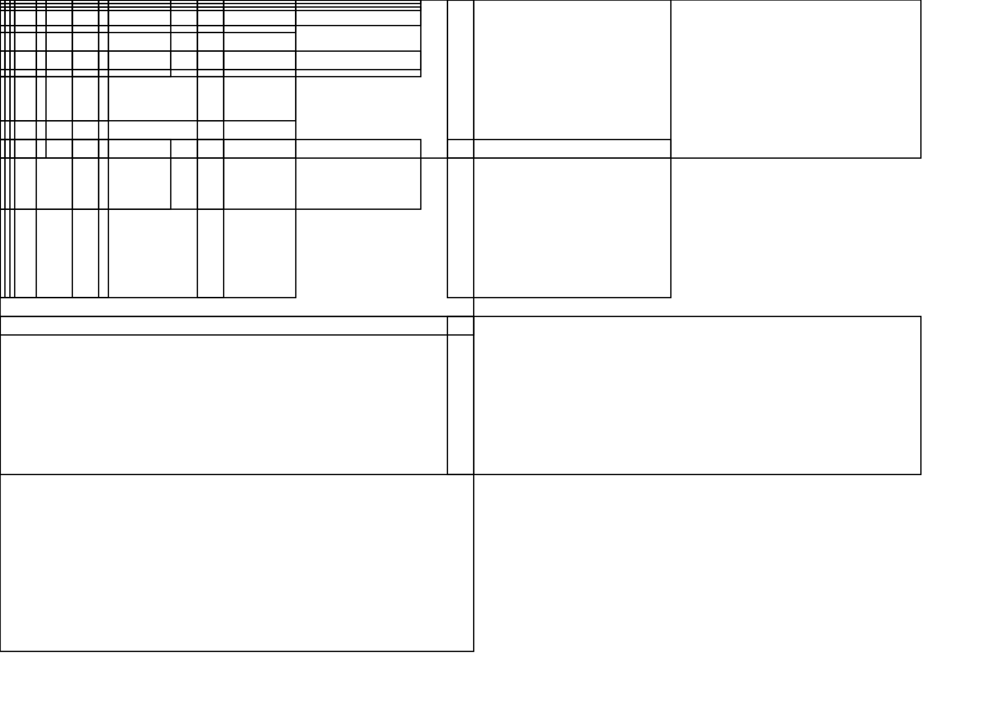
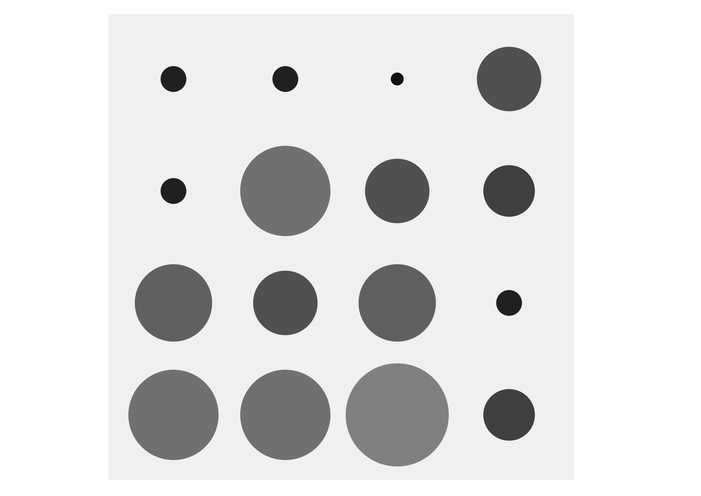
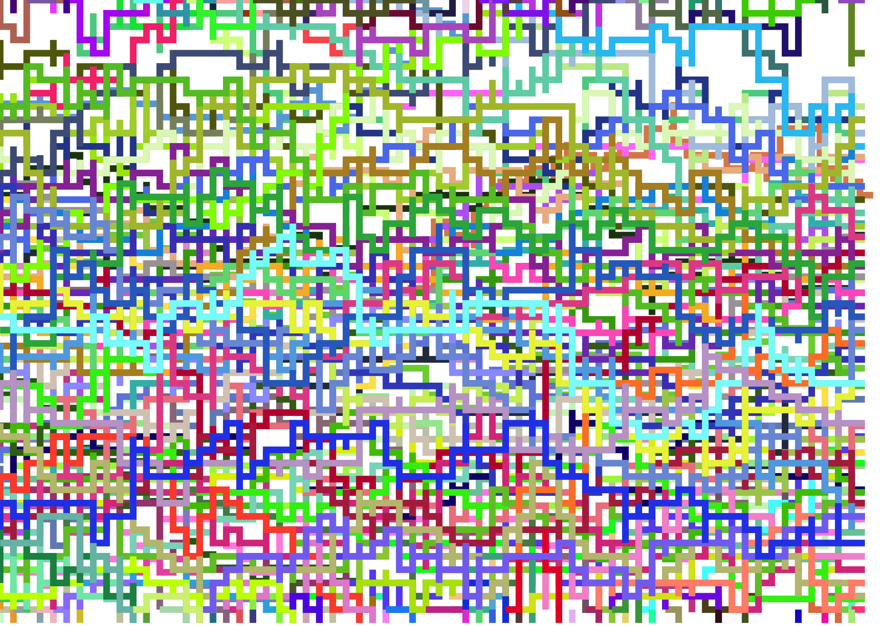
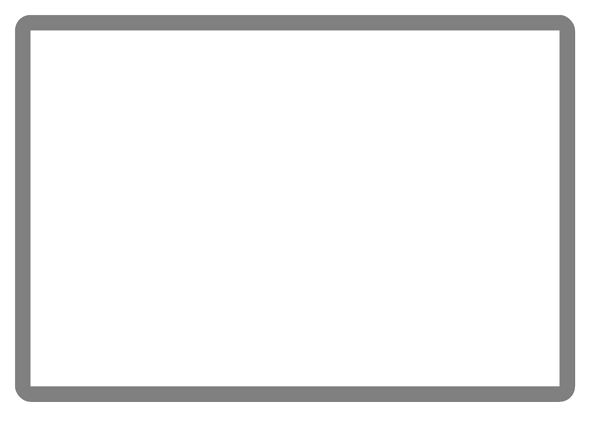
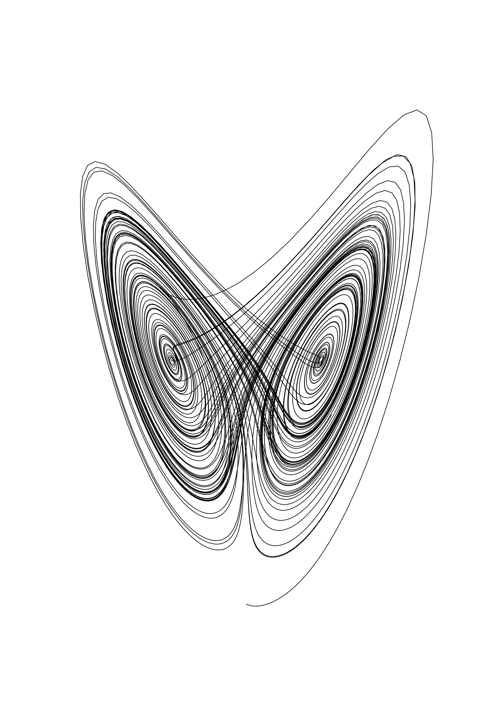

# genuary

my attempts at the genuary.art prompts

# Day 1: "Particles, lots of them."

## Day 2: No palettes.

## Day 3: "Droste effect.

## Day 4: "Pixels."

## Day5: In the style of Vera Molnár (1924-2023).

## Day6: Screensaver.

## Day7: Progress bar / indicator / loading animation.

## Day8: Chaotic system.

## Day9: ASCII.

TBC

## Day10: Hexagonal.

TBC

## Day11: In the style of Anni Albers (1899-1994).

TBC

## Day12: Lava lamp.

TBC

## Day13: Wobbly function day.

TBC

## Day14: Less than 1KB artwork.

TBC

## Day15: Use a physics library.

TBC

## Day16: Draw 10 000 of something.

## Day17: Inspired by Islamic art.

TBC

## Day18: Bauhaus.

TBC

## Day19: Flocking.

## Day20: Generative typography.

TBC

## Day21: Use a library that you haven’t used before.

TBC

## Day22: Point - line - plane.

TBC

## Day23: 64×64.

TBC

## Day24: Impossible objects (undecided geometry).

TBC

## Day25: “I should try to recreate this with code”.

TBC

## Day26: Grow a seed.

TBC

## Day27: Code for one hour.

TBC

## Day28: Skeuomorphism.

TBC

## Day29: Signed Distance Functions (if we keep trying once per year, eventually we will be good at it!).

TBC

## Day30: Shaders.

TBC

## Day31: Generative music / Generative audio / Generative sound.

TBC
